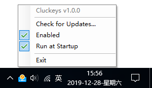

<h1 align="center">Cluckeys </h1>

Adds Switch's UI sounds to your keyboard presses.

## Keys available

- :white_check_mark: <kbd>All Keys</kbd>
- :white_check_mark: <kbd>Ctrl</kbd> + <kbd>C</kbd>
- :white_check_mark: <kbd>Ctrl</kbd> + <kbd>V</kbd>
- :white_check_mark: <kbd>Ctrl</kbd> + <kbd>Z</kbd>
- :white_check_mark: <kbd>Ctrl</kbd> + <kbd>Shift</kbd> + <kbd>C</kbd>
- :white_check_mark: <kbd>Ctrl</kbd> + <kbd>Shift</kbd> + <kbd>V</kbd>
- :white_check_mark: <kbd>Ctrl</kbd> + <kbd>Shift</kbd> + <kbd>Z</kbd>
- :white_check_mark: <kbd>Shift</kbd> + <kbd>0-9</kbd>
- :white_check_mark: <kbd>Windows</kbd> + <kbd>L</kbd>

## Installation

- Download and install [.NET Core SDK](https://dotnet.microsoft.com/download)
- Download and install `Cluckeys`
- Run `Cluckeys`:

  

***Note**: in order to run Cluckeys, you'll need to be running at least Windows build 17134 or higher.*

## Download

Cluckeys can be downloaded from the [Cluckeys GitHub releases page](https://github.com/YiiGuxing/Cluckeys/releases/latest).
Click on `Assets` to show the files available in the release and then click on `CluckeysSetup.msi` to download the Cluckeys installer.

# Acknowledgements

Cluckeys is heavily inspired by [keyboard_sounds](https://github.com/LiaoBill/keyboard_sounds).
